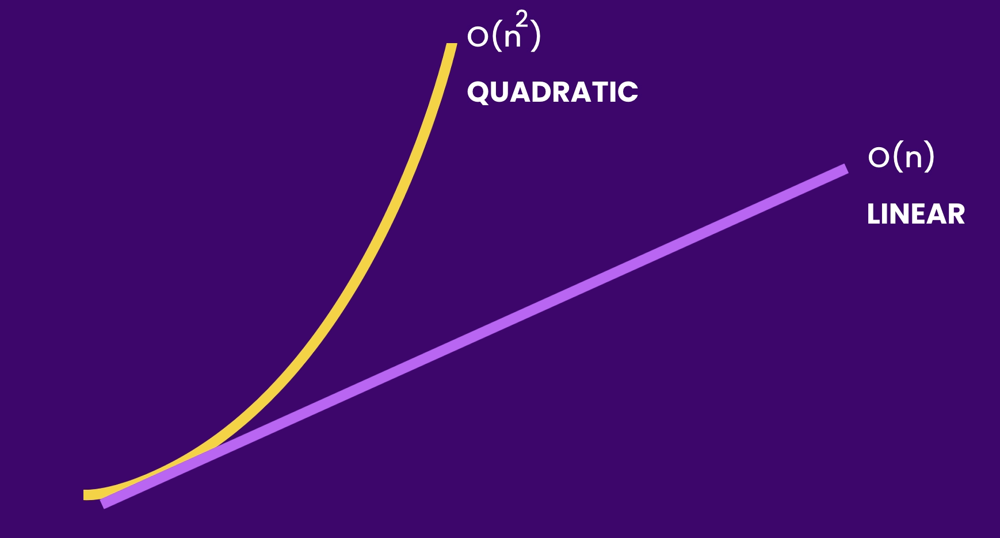
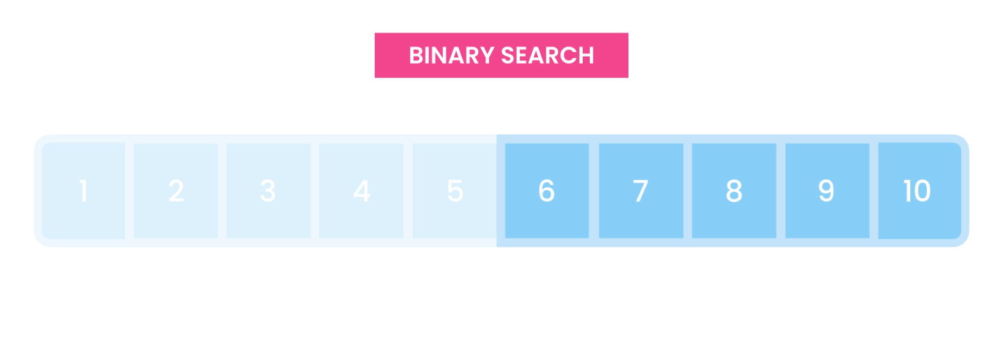
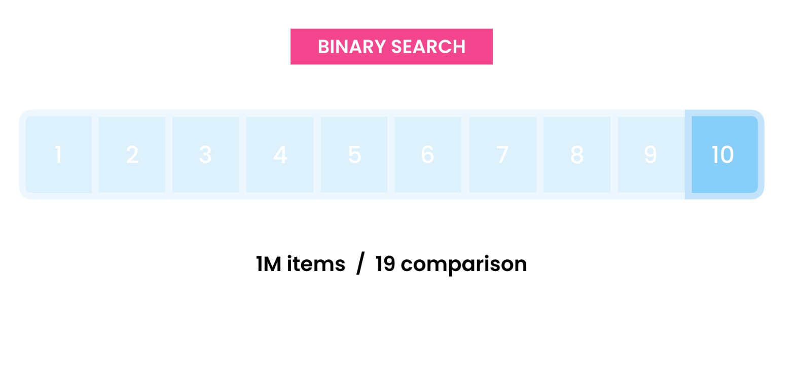
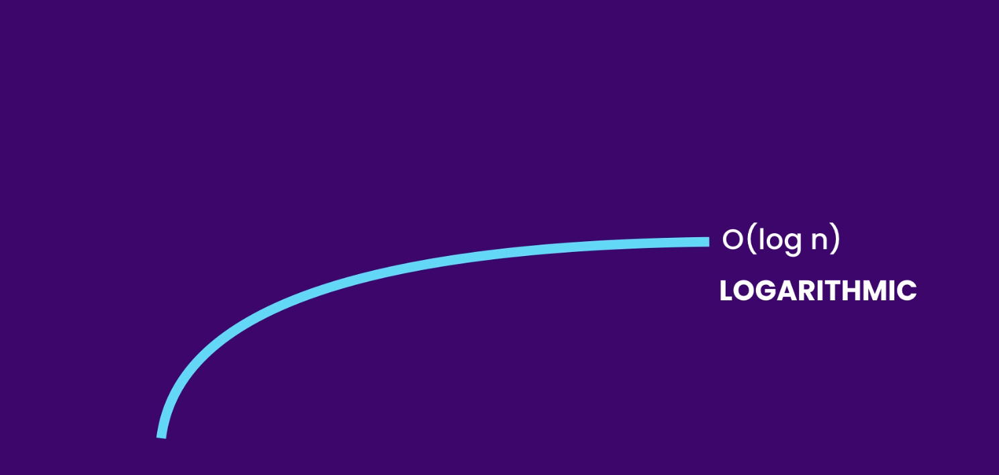
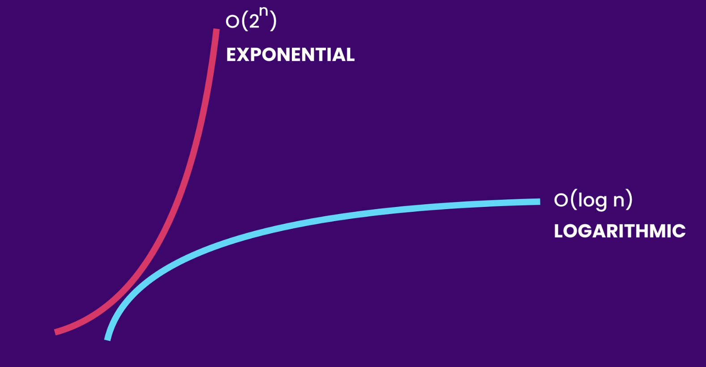
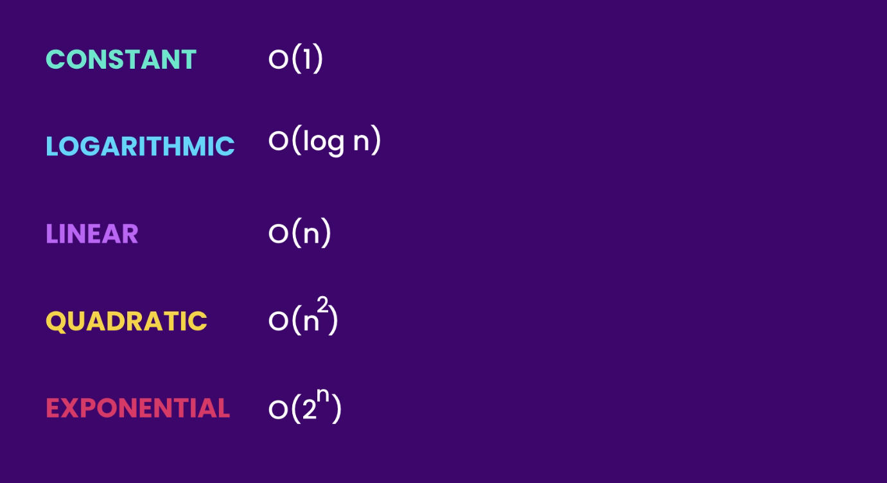
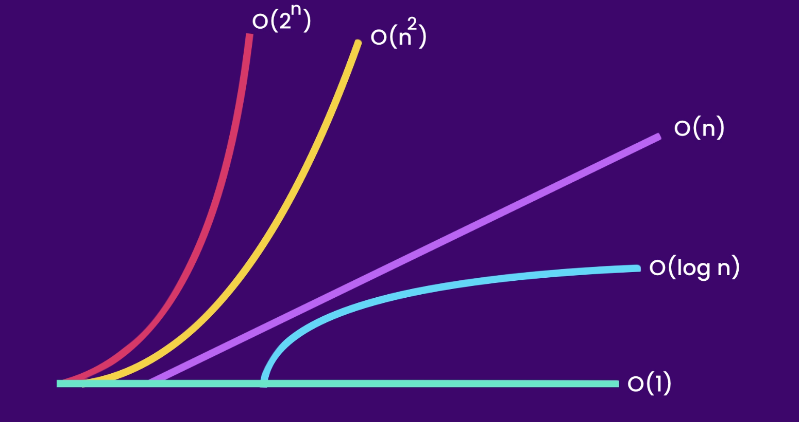

# Data Structures and Algorithms

## Table of Contents
1. Linear Data Structures
    1. [Arrays](#arrays)
    2. [Linked Lists](#linked-lists)
    3. [Stacks](#stacks)
    4. [Queues](#queues)
    5. [Hash Tables](#hash-tables)


## Big O Notation
Big O notation is a mathematical notation that describes the limiting behavior of a function when the argument tends towards a particular value or infinity. It is a member of a family of notations invented by Paul Bachmann, Edmund Landau, and others, collectively called Bachmann-Landau notation or asymptotic notation.

We use Big O notation to describe the performance of an algorithm. It is a way to describe the upper bound of the time complexity of an algorithm. It is scalable or not.

**O(n)**

In a nutshell, How scalable is the algorithm? How does the algorithm behave when the input size increases?

### 0(1)
- Constant time complexity
- The time complexity of an algorithm is constant, i.e., it does not depend on the input size.
- Example: Accessing a first element in an array by index.

```java
public void log(int[] numbers){
    // O(1)
   System.out.println(numbers[0]);
   System.out.println(numbers[0]);
}
```

### O(n)
- Linear time complexity
- The time complexity of an algorithm is directly proportional to the input size.
- Example: Iterating over an array.

```java 
public void log(int[] numbers){
    // O(n) - > n is the size of the array
   // O (1+ n + 1) = O(2 + n) = O(n)
    System.out.println(); // O(1)
    for(int number: numbers){   // O(n)
        System.out.println(number);
    }
   System.out.println();   // O(1)

//   for (int i = 0; i < numbers.length; i++) {
//       System.out.println(numbers[i]);
//   }
}
```

```java
public void log(int[] numbers){
    //  0(n+n) = 0(2n) = 0(n)
    // 0(n)
   for (int number: numbers)
       System.out.println(number);
   
   // 0(n)
   for (int number: numbers)
       System.out.println(number);
}
```

```java
public void log(int[] numbers, String[] names){
    // 0(n+m) = 0(n)
    // 0(n)
   for (int number: numbers)
       System.out.println(number);
   
   // 0(m)
   for (int name: names)
       System.out.println(name);
}
```

### O(n^2)
- Quadratic time complexity
- The time complexity of an algorithm is directly proportional to the square of the input size.
- Example: Nested loops

```java
 public void log(int[] numbers){
    // 0(n*n) = O(n^2)
    for (int first: numbers){   // O(n)
        for (int second: numbers){  // O(n)
            System.out.println(first + ", " + second);
        }
    }
}
```

```java
 public void log(int[] numbers){
    // 0(n+ n^2) = O(n^2)
    for(int number: numbers){   // O(n)
        System.out.println(number);
    }
    
    for (int first: numbers){   // O(n)
        for (int second: numbers){  // O(n)
            System.out.println(first + ", " + second);
        }
    }
}
```

```java
public void log(int[] numbers){
    // 0(n^3)
    for (int first: numbers){   // O(n)
        for (int second: numbers){  // O(n)
            for (int third: numbers){  // O(n)
                System.out.println(first + ", " + second + ", " + third);
            }
        }
    }
}
```


Input grows larger and larger, the time complexity of the algorithm grows quadratically. will become slower and slower.


### O(log n)
- Logarithmic time complexity
- The time complexity of an algorithm is logarithmic with respect to the input size.
- Logarithmic time is more efficient and more scalable than linear time complexity.
- Linear search is proportional to the size of the input.
- Example: Binary search


- Binary search is a search algorithm that finds the position of a target value within a sorted array.
- Binary search compares the target value to the middle element of the array.
- If the target value is equal to the middle element, its position in the array is returned.
- If the target value is less than the middle element, the search continues in the lower half of the array.
- If the target value is greater than the middle element, the search continues in the upper half of the array.


- Binary search is more efficient than linear search.
- Binary search is a divide-and-conquer algorithm.
- Binary search is a recursive algorithm.
- Binary search is a fast search algorithm with a time complexity of O(log n).






### O(2^n)
- Exponential time complexity
- The time complexity of an algorithm is exponential with respect to the input size.
- Exponential time complexity is the least efficient and least scalable.
- Opposite of logarithmic time complexity.



# Summary




### Space Complexity
Space complexity is a measure of the amount of working storage an algorithm needs. It refers to the total amount of memory space required by the algorithm to complete its execution. This includes the memory space needed for:

1. **Input storage**: Memory required to store the input data.
2. **Auxiliary storage**: Memory required for any additional variables and data structures used during the algorithm's execution.
3. **Function call stack**: Memory required for function calls, including parameters, return addresses, and local variables.

Space complexity is usually expressed in terms of Big O notation, similar to time complexity. It helps in understanding how the memory requirements of an algorithm grow with the size of the input.

For example:
- **O(1)**: Constant space d, where the memory required does not change with the input size.
- **O(n)**: Linear space complexity, where the memory required grows linearly with the input size.
- **O(n^2)**: Quadratic space complexity, where the memory required grows quadratically with the input size.

Understanding space complexity is crucial for optimizing algorithms, especially when dealing with large datasets or limited memory environments .


# Linear Data Structures
## Arrays 
